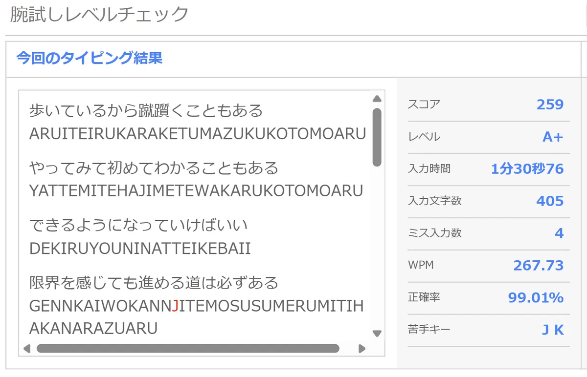

# Benchmarks and Research Notes

Fujin Layout is an early-stage accessibility-focused keyboard layout project.
The first public release is based on personal training data and repeatable
typing drills, not a large external user study yet.

## Current Result

After roughly two weeks of practice at 2 to 3 hours per day, Fujin reached
e-typing A+ rank with a score of 259 using left-hand-only input. This exceeds
the commonly cited all-user average for two-handed QWERTY Japanese romaji
typing, around 220 points.

## Demo Video

- YouTube: [片手タイピング e-typingスコア「A」231点](https://www.youtube.com/watch?v=n7-D5fHuksI)

## Score Details

From the current best screenshot:

- Score: 259
- Level: A+
- Input time: 1:30.76
- Input characters: 405
- Mistyped characters: 4
- WPM: 267.73
- Accuracy: 99.01%

## What This Shows

- Left-hand-only Japanese romaji input can become practical without custom
  hardware.
- A normal Windows PC and a standard QWERTY keyboard are enough to try the
  layout.
- The design may help users with one-handed disability, injury, or temporary
  mobility limits keep a high level of Japanese text input productivity.

## What Still Needs Validation

- More users with different hand sizes, keyboards, and typing histories.
- Longer-term comfort and fatigue comparison against QWERTY and other
  one-handed methods.
- Cross-platform implementation beyond AutoHotkey on Windows.
- Publicly reproducible benchmark scripts and typing corpora.

## Related Research

- Design article: https://note.com/honjoh_/n/nd629dd645255
- Base layout: https://github.com/honjoh0823/yamato-layout
